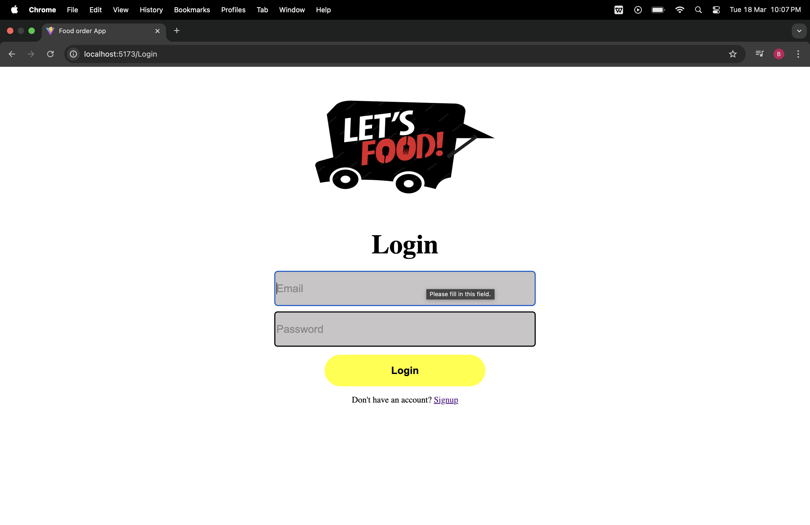
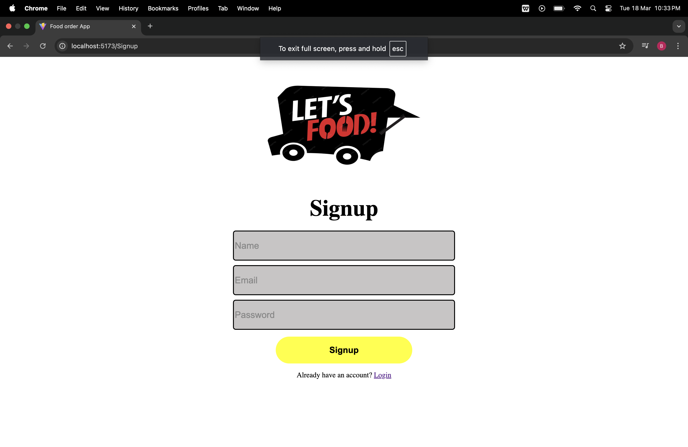
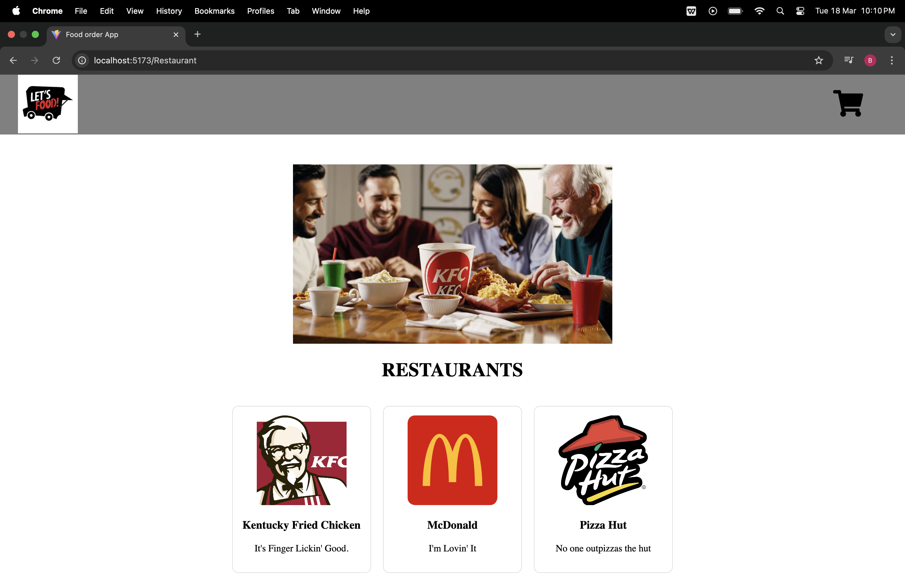
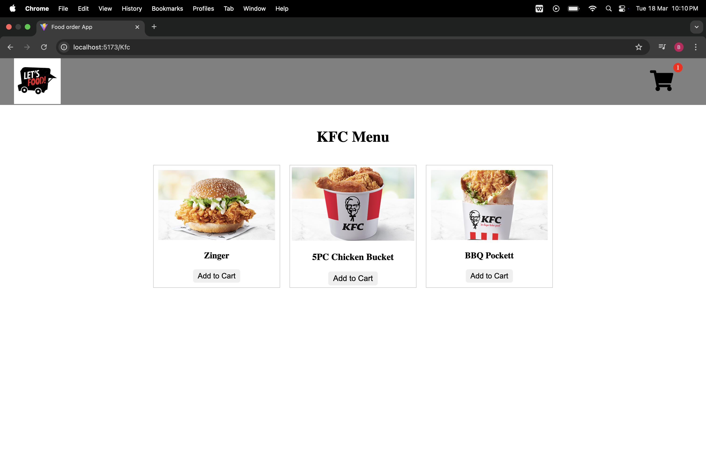
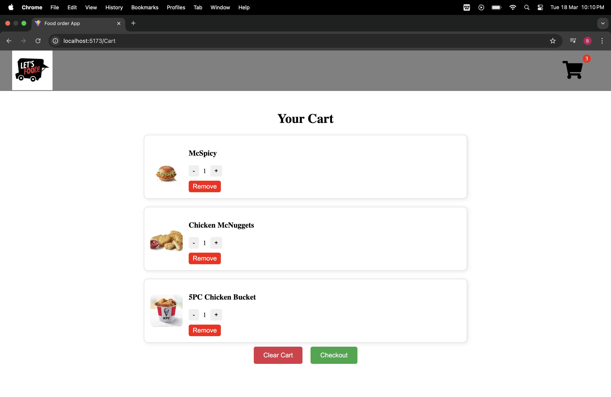
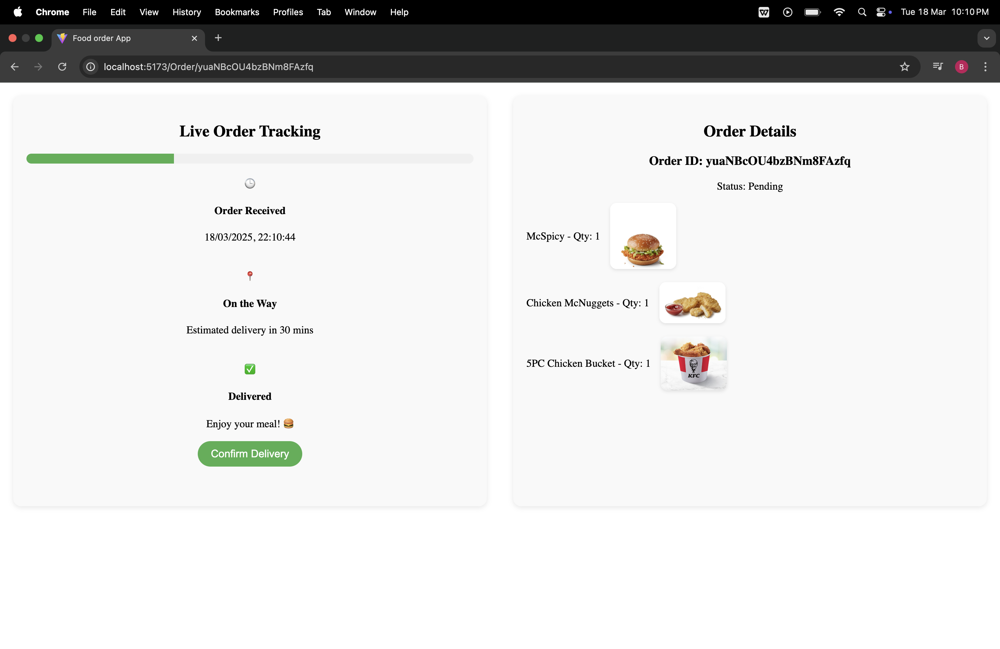

# food ordering app

- this app is a food ordering concept app that allow user to place order and track there order progression using firebase realtime database

## Features

This app allows users to:

- place order from the ui to the cart.
- **Authenticate** themselves to gain access to the app with approved credentials.
- **Sign up** allow user to create a account to let them access to the app.
- allow user to see your order progression in the order page.
- User also will be log out of the page after token expire.

---

## Preview

### Login in page

### Sign Up page

### Restaurants page

### Menu Page

### Cart Page

### Order Page

---

## Built with

- Javescript
- ExpressJS
- JWT
- Sequelize
- mySQL
- Firebase Storage
- ReactJS

## API required

- Firebase
